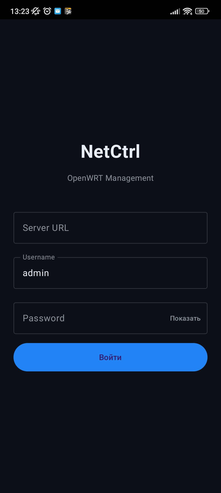
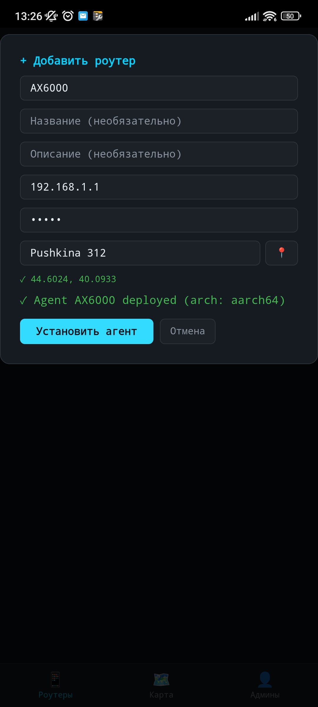
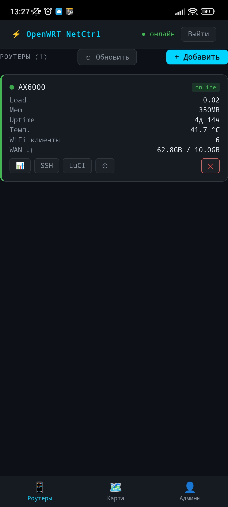
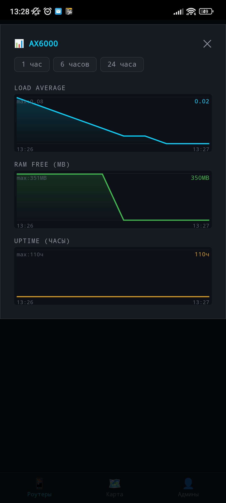
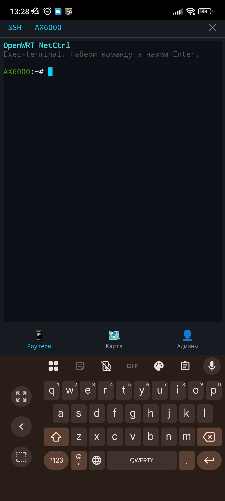
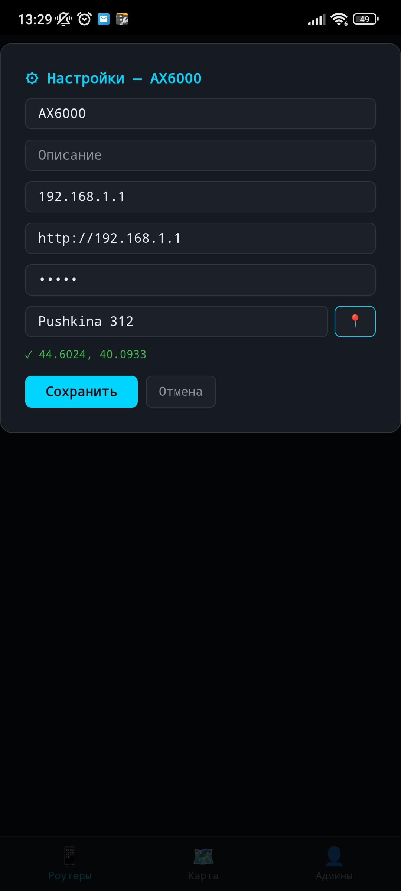
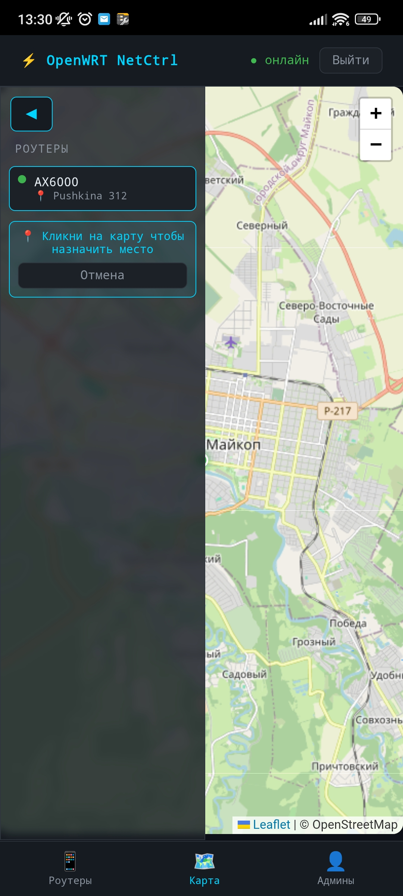
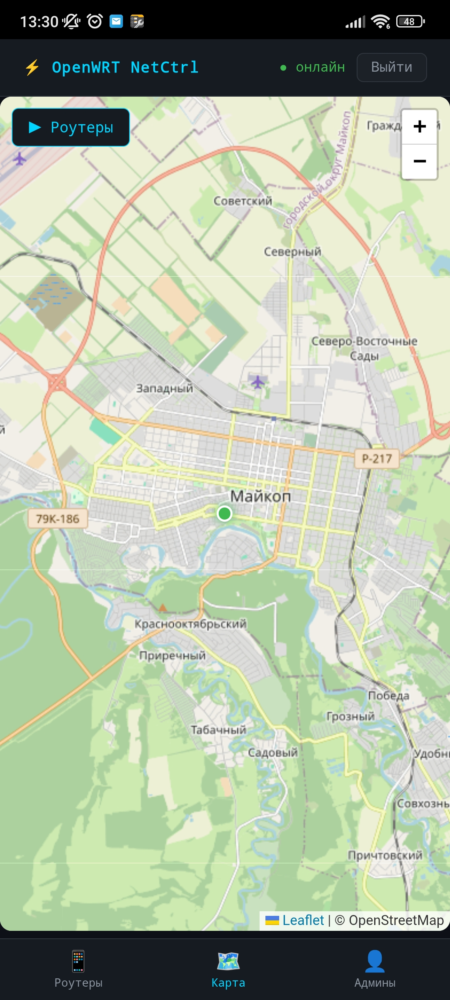
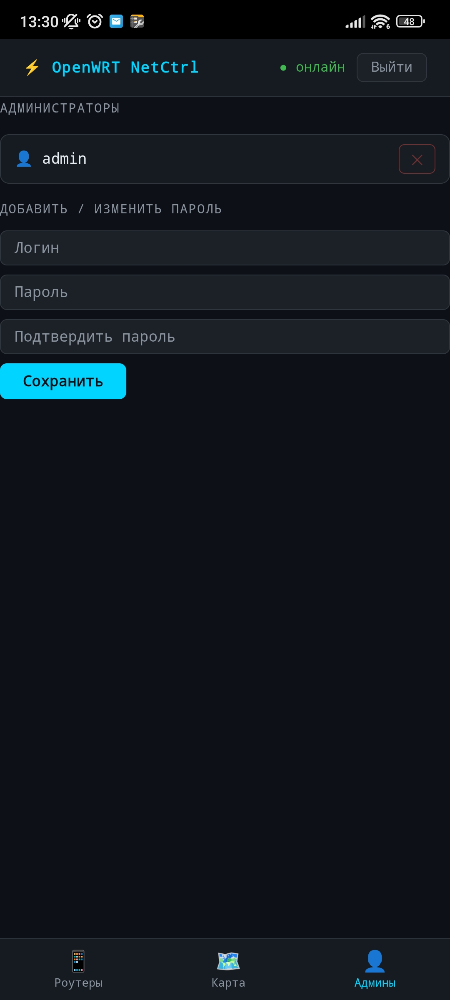

# ⚡ OpenWRT NetCtrl

**Нативная панель управления флотом роутеров OpenWRT**

Централизованное управление роутерами OpenWRT с единого экрана — Linux десктоп и Android APK.

---

## 🚀 Возможности

- 📡 **Мониторинг в реальном времени** — Load, RAM, Uptime, температура, WiFi клиенты, WAN трафик
- 📊 **Графики метрик** — SVG графики Load Average, RAM Free, Uptime за 1/6/24 часа
- 🗺️ **Карта роутеров** — Leaflet + OpenStreetMap, маркеры по геолокации, геокодинг через Nominatim
- 🖥️ **SSH терминал** — прямо в браузере / WebView через xterm.js
- 🔧 **Bootstrap агента** — автоматический деплой агента на роутер по SSH
- 🔐 **JWT авторизация** — bcrypt, управление пользователями
- 📱 **Android APK** — нативный экран логина (Kotlin + Jetpack Compose) + WebView UI
- 🤖 **Telegram-бот** — выдача WireGuard ключей

---

## 📱 Скриншоты

<table>
  <tr>
    <td align="center"><b>Логин</b></td>
    <td align="center"><b>Добавить роутер</b></td>
    <td align="center"><b>Dashboard</b></td>
  </tr>
  <tr>
    <td></td>
    <td></td>
    <td></td>
  </tr>
  <tr>
    <td align="center"><b>Метрики</b></td>
    <td align="center"><b>SSH терминал</b></td>
    <td align="center"><b>Настройки роутера</b></td>
  </tr>
  <tr>
    <td></td>
    <td></td>
    <td></td>
  </tr>
  <tr>
    <td align="center"><b>Карта (список)</b></td>
    <td align="center"><b>Карта (полная)</b></td>
    <td align="center"><b>Администраторы</b></td>
  </tr>
  <tr>
    <td></td>
    <td></td>
    <td></td>
  </tr>
</table>

---

## 🏗️ Архитектура

```
[owm-ui :1420]  ←→  [owm-server :9000]  ←→  [owm-agent на роутере]
   Vue 3              Rust/Axum              Rust статический бинарник
   SVG графики        SQLite + JWT           /proc метрики
   Leaflet 1.9.4      Bootstrap SSH          WebSocket + heartbeat 10s

[Android APK]  ←→  [owm-server :9000]
   Kotlin + Jetpack Compose
   Нативный логин → токен в DataStore
   WebView → owm-ui
```

### Стек

| Компонент | Технология |
|---|---|
| Бэкенд | Rust, Axum 0.7, SQLite |
| Авторизация | JWT + bcrypt |
| Web UI | Vue 3, Vite 5 |
| Карта | Leaflet 1.9.4 + OpenStreetMap |
| SSH терминал | xterm.js |
| Графики | Чистый SVG (без Chart.js) |
| Android | Kotlin, Jetpack Compose, WebView |

---

## 📦 Установка

### Требования
- Linux (x86_64 или aarch64)
- Роутер с OpenWRT и включённым SSH

### Быстрый старт

```bash
# 1. Скачать бинарники из Releases
# 2. Запустить сервер
export SERVER_HTTP_URL=http://YOUR_IP:9000
export SERVER_WS_URL=ws://YOUR_IP:9000
export JWT_SECRET=$(openssl rand -hex 32)
./owm-server

# 3. Открыть UI
# http://YOUR_IP:1420
# Логин: admin / Пароль: admin
```

### Android APK
Скачать `OpenWRT-NetCtrl-v1.0.0.apk` из [Releases](../../releases) и установить.

При первом запуске ввести адрес сервера в формате `http://IP:9000`.

---

## 🤖 Поддерживаемые архитектуры агента

| Архитектура | Роутеры |
|---|---|
| `aarch64` | Xiaomi Redmi AX6000, Asus AX59U, GL.iNet AX серии |
| `mipsel` | TP-Link Archer, D-Link, большинство бюджетных роутеров |

---

## 🖥️ Серверные платформы

- Linux x86_64 (ПК, VPS)
- Linux aarch64 (Vontar X3, Raspberry Pi, Orange Pi)

---

## 📁 Структура релиза

```
OpenWRT-NetCtrl-v1.0.0.apk     ← Android приложение
owm-server-x86_64              ← Сервер для Linux x86_64
owm-server-aarch64             ← Сервер для Linux ARM64
owm-agent-aarch64              ← Агент для ARM64 роутеров
owm-agent-mipsel               ← Агент для MIPS роутеров
```

---

## 🔧 Сборка из исходников

```bash
# Сервер
cd OpenWrt_Ctrl
cargo build --release

# Агент для aarch64
cross build -p owm-agent --target aarch64-unknown-linux-musl --release

# Агент для mipsel
cross build -p owm-agent --target mipsel-unknown-linux-musl --release

# Android APK
cd netctrl-android
KEYSTORE_PASS=your_pass ./gradlew assembleRelease
```

---

## 📌 Связанные проекты

- [openwrt-netctrl](https://github.com/imbazyx/openwrt-netctrl) — первая версия (Node.js/Docker, завершён)

---

## 👤 Автор

**imbazyx** — [GitHub](https://github.com/imbazyx)

---

*OpenWRT NetCtrl — управление роутерами из одного окна*
