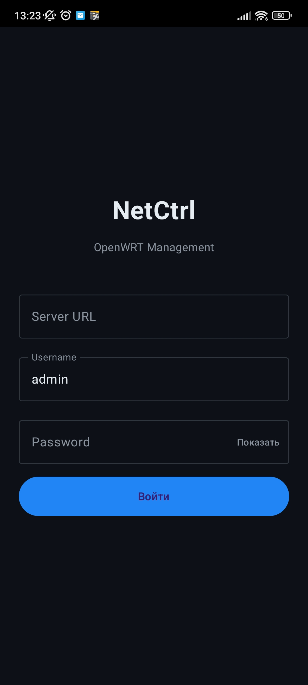
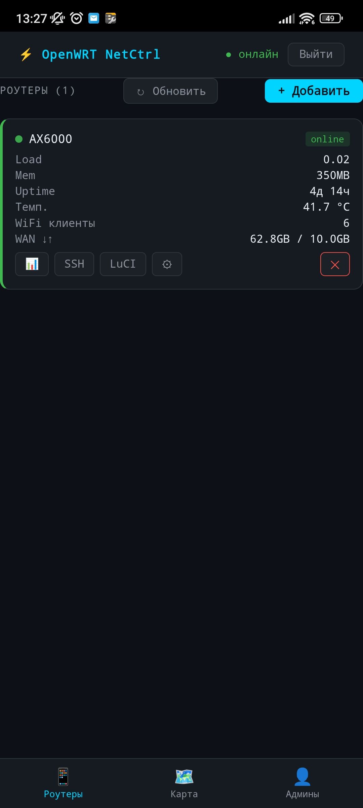
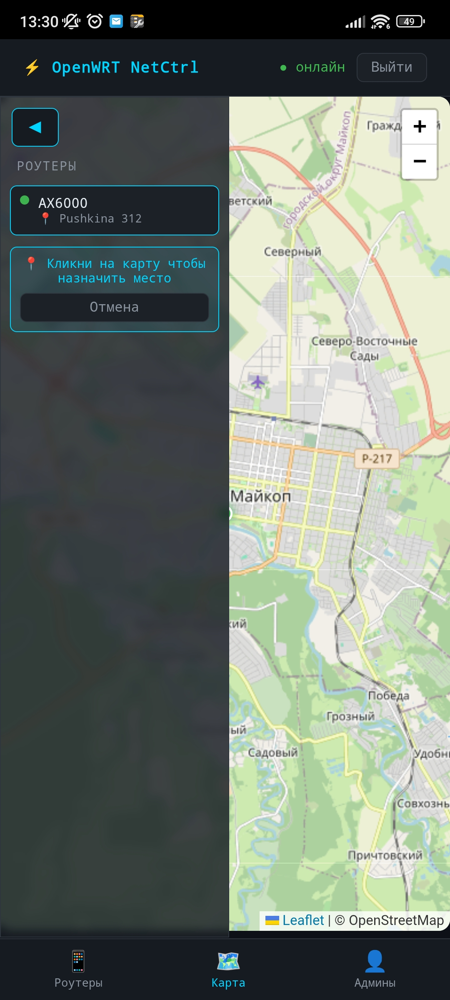

# ⚡ OpenWRT NetCtrl — Android

Нативная обёртка над веб-панелью [openwrt-netctrl](https://github.com/imbazyx/openwrt-netctrl).

Это **не второй сервер**. Приложение не опрашивает роутеры самостоятельно:
оно логинится в панель, получает токен и открывает её UI в WebView.
Всё остальное — карта, графики, SSH-терминал, LuCI, настройки — рисует сама панель.

---

## Зачем так

Панель уже умеет всё, что нужно, и обновляется без публикации нового APK.
Дублировать её нативный UI — значит поддерживать две реализации одного и того же.
Нативным оставлен только вход: он и не требует JavaScript, и даёт нормальное
сохранение токена.

---

## 📱 Скриншоты

<table>
  <tr>
    <td align="center"><b>Логин</b></td>
    <td align="center"><b>Панель</b></td>
    <td align="center"><b>Панель</b></td>
  </tr>
  <tr>
    <td></td>
    <td></td>
    <td></td>
  </tr>
</table>

---

## 🏗️ Как это работает

```
[Android APK] ──POST /api/auth/login {password}──→  [панель NetCtrl :3000]
     │                                                  │
     │  ←── {token} ──────────────────────────────────┘
     │
     │  WebView грузит UI панели; токен кладётся в sessionStorage
     │  и оттуда панель сама ставит заголовок x-auth-token
     ▼
  WebView: карта, графики, SSH-терминал, LuCI, настройки
```

### Контракт

Приложение знает ровно два вызова:

| Вызов | Где |
|---|---|
| `POST /api/auth/login` с `{password}` | `ServerApi.kt` |
| всё остальное (`/api/routers`, `/api/stats`, …) | делает JS панели |

Токен едет в заголовке `x-auth-token`. Логина и пароля отдельно нет —
в панели один администратор.

### Куда попадает токен

- в `sessionStorage` origin'а **панели** — оттуда панель берёт его для
  своих запросов и для WebSocket SSH;
- **никуда больше**. Страницы `/proxy/:id` и `/luci-login/:id` — это чужой код
  роутера на origin панели, туда токен не подставляется;
- в `DataStore` приложения, чтобы не вводить пароль каждый раз.

Если пароль сменить прямо в панели, приложение подхватывает новый токен
при следующей загрузке страницы.

---

## 🔐 Про сборку

Подпись берётся из `keystore.properties` в корне репозитория:

```properties
storeFile=netctrl-release.jks
storePassword=...
keyAlias=netctrl
keyPassword=...
```

Если файла нет или он не найден — релиз просто собирается **без подписи**,
сборка не падает. Путь к keystore больше не зашит в `build.gradle.kts`.

`keystore.properties` и `*.jks` в `.gitignore`.

---

## 🔧 Сборка

```bash
# отладочная
./gradlew :app:assembleDebug

# релизная (подпишется, если есть keystore.properties)
./gradlew :app:assembleRelease

# APK
app/build/outputs/apk/release/app-release.apk
```

Требуется JDK 17 и Android SDK 34. Путь к SDK — в `local.properties`
(`sdk.dir=...`, прямые слэши, не обратные).

---

## 📐 Стек

| Компонент | Технология |
|---|---|
| UI | Kotlin, Jetpack Compose (Material 3) |
| Состояние | `ViewModel` + `StateFlow` |
| Хранилище | DataStore Preferences |
| Сеть | OkHttp |
| Панель | WebView |

Зависимости минимальные: ни Retrofit, ни GSON, ни навигации — всё, что нужно
для одного запроса логина и одного WebView.

---

## 📌 Связанные проекты

- [openwrt-netctrl](https://github.com/imbazyx/openwrt-netctrl) — сервер и веб-панель.
  Без запущенной панели приложение бесполезно.

---

## 👤 Автор

**imbazyx** — [GitHub](https://github.com/imbazyx)

---

*OpenWRT NetCtrl — управление роутерами из одного окна*